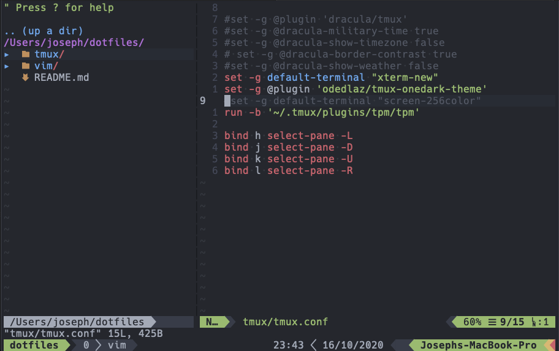

# Dotfiles
These are my dotfiles.

## Vim
Install [vundler](https://github.com/VundleVim/Vundle.vim)

Assuming you cloned this repo, append this in your `.vimrc`


```
so $HOME/path/to/your/cloned/dotfiles/vim/vimrc.vim
```

Install plugins via vundle

```
:InstallPlugins
```

## Tmux

This is for your `.tmux.conf` file

```
source-file $HOME/path/to/your/cloned/dotfiles/tmux/tmux.conf
```

Install tmux plugins

```
<leader-key>-I
```
That's `Ctrl-b` for leader key then `Shift-I`

## Preview


